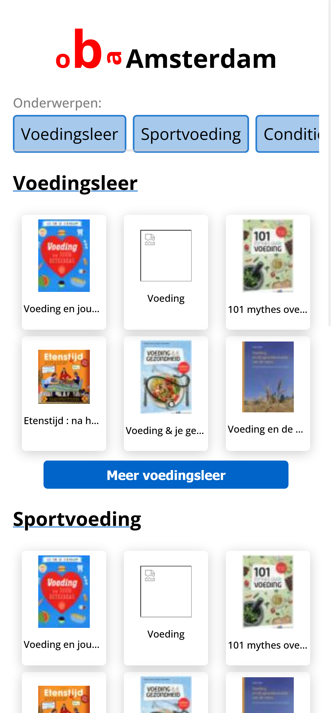

# ⚙ Healty food helper


## 📂 Assignment
The assignment is again to built a SPA with a givev user story and certain API's the user story is:
Voeding en diëtiek, als sportieve twintiger wil ik mij verdiepen in het effect van gezonde voeding op mijn conditie, om te leren hoe ik mijn sport beter kan beoefenen.

## 🧾 Table of contents
-   [About the project](##About-the-project)
      * [Built with](###Built-with)
      * [Features](###Features)
-   [Activity Diagram](##Activity-Diagram)
-   [Getting started](##Getting-started)
      * [Installation](##Installation)
-   [License](##License)

## 📖 About the project
The project is built for the OBA in Amsterdam, they want to have a way to let users search on topic and have related books/articles/lessons with that.
The data comes from the given OBA API, the API gives a lot of data and has a lot of possibilities for searching and different kind of queries, downside is that the API is almost always overloaded on 'Live Server' in VSCODE, if deployed to Github the API can make easy call and gets a good response.

### 🛠 Built with
The project is built with Vanilla JS, HTML and CSS

### 🌟 Features
- Look for different kind of topics
- See a detail page about the book you clicked on, for now it's a static page with chosen data because of API restrictions while developing.

### ✔ Checklist
Checklist for showing what is done and what still can be done.<br>
- [x] Look for a book per category
- [x] Different categories
- [x] Detail page
- [ ] Detail page correctly filled with data from the book that has been clicked on
- [ ] Better UI
- [ ] Better styling
- [ ] Better design overall
- [ ] Recommended articles/books/lessons per book clicked on

## 🔍 Getting started
*Before you can start you need to follow the installation*

## 🔨 Installation
1. Open the terminal, or use the terminal in your IDE

2. Clone the repository
```
git clone https://github.com/KoenHaagsma/Healty-food-helper.git
```
3. Go to the cloned repository
```
cd ../../Healty-food-helper
```
4. Start application with [Live-Server in VSCODE](https://marketplace.visualstudio.com/items?itemName=ritwickdey.LiveServer)
```
Right bottom: 'Go live'
```

## 📑 Sources
- [OBA](https://www.oba.nl/)
- [Food-Finder project](https://github.com/KoenHaagsma/Food-Finder)

## 🔖 License
[]()
